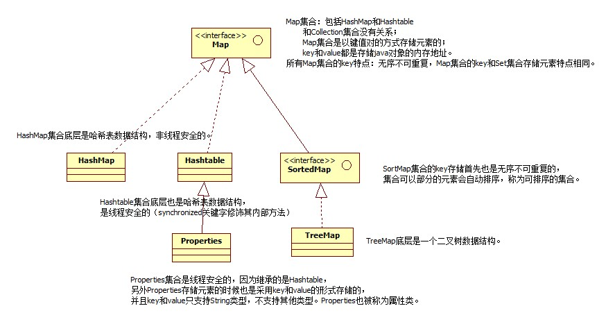
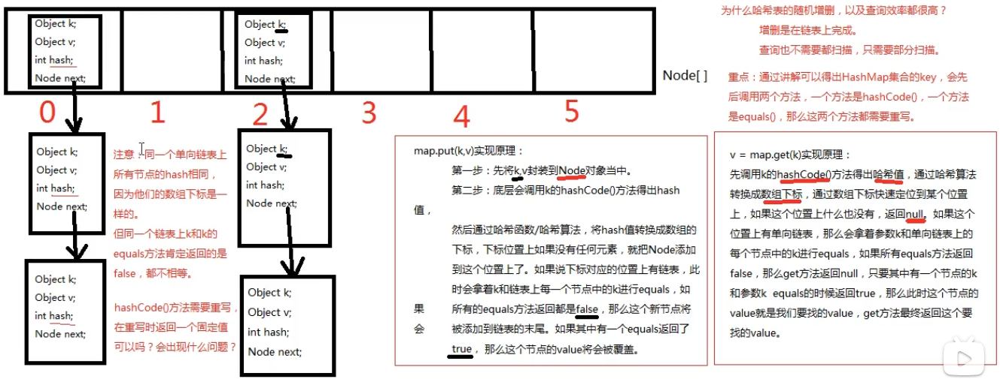
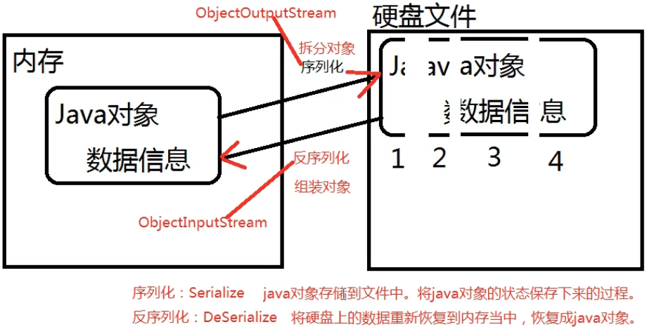
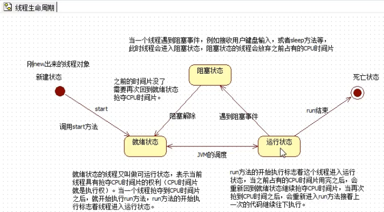

-->基本数据类型相关结论：

1.byte,short,char做混合运算的时候，会先分别将各自的字符转为int类型，再做计算；

2.多种数据类型做混合运算的时候，最大的数据类型作为最终结果的数据类型。

3.如果整数型字面量没有超出byte,short char的取值范围，可以直接将其赋值给byte,short,char类型的变量；

\--------------------------------------------------------------------

（1）什么时候用到方法重载？

答：在同一个类中，如果功能1和功能2它们功能是相似的，那么可以考虑将它们的方法名写成一样的，这样的代码既美观，又便于后期的代码编写（易记易用）。

（2）什么时候代码会发生方法重载？

答：条件1：在同一个类中；

​	   条件2：方法名相同；

​	   条件3：参数列表不同

​				a.参数的个数不同

​				b.参数的类型不同

​				c.参数的顺序不同

​		同时满足以上3个条件，那么我们可以认定方法和方法之间发生了重载机制。

！！！注意：区分方法的重复！！！

​		   方法重载和返回值类型无关

​		   方法重载和修饰符列表（pubic static...）无关

---------------------------------------------------------------------第八章 面向对象

1.什么是面向过程的开发方式？

（1）面向过程的开发方式主要特点是：

​	注重步骤，注重的是实现这个功能的步骤。

​	第一步做什么，第二步做什么。

​	

（2）另外面向过程也注重实现功能的因果关系。

​	因为A所以B

​	因为B所以C

​	因为C所以D	

​	面向过程中没有对象的概念，只是实现这个功能的步骤以及因果关系。

（4）面向过程有什么缺点？

​	面向过程最主要是每一步与每一步的因果关系。其中A步骤因果关系到B步骤，A和B联合起来形成一个子模块，子模块和子模块之间又因为因果关系结合在一起，假设其中任何一个因果关系出现问题，此时整个系统的运转都会出现问题。（代码之间的耦合度太高，扩展能力太差）

（5）面向过程有什么优点？

​	对于小型项目（功能），采用面向过程的方式进行开发，效率较高。不需要前期进行对象的提取，模型的建立，采用面向过程的方式可以直接开始干活，一上来直接写代码，编写因果关系，从而实现功能。

2.什么是面向对象的开发方式？

​	面向对象就是将现实世界分割成不同的单元，然后每一个单元都实现对象，然后驱动一下，让各个对象之间协作起来形成一个系统。


---------------------------------------------------------------------局部变量放在栈中，通过new运算符创建的对象，都存储在堆内存中。new运算符的作用就是在堆内存中开辟一块存储空间。

-String属于引用数据类型，默认值为null。不同于基本数据类型（byte、short、int、long、float、double、boolean、char）。

 

**226-Java零基础-创建对象对应的JVM内存结构 P385 - 26:60**


\--------------------------------------------------------------------


**227-Java零基础-创建对象对应的JVM内存结构 P386 - 12:34**


怎么访问实例变量？

​	语法：引用.实例变量名

Student s = new Student();

​	其中，s叫做引用，放在栈中，而new Student()是实例化的对象，放在堆内存中，s通过内存地址访问new的对象。 

\--------------------------------------------------------------------

构造方法

​	当一个类没有提供构造方法时，系统会默认提供一个无参数的构造方法，这个方法称为缺省构造器。

-构造方法的特点：

​	构造方法名和类名一致；

​	构造方法没有返回值类型；

​	构造方法支持重载；

**240-Java零基础-构造方法 P399 - 00:03**


 --------------------------------------------------------------------封装

​	怎么封装？

​	第一步：属性私有化（使用private关键字进行修饰）；

​	第二步：提供简单的外部访问入口。（getter and setter）


---------------------------------------------------------------------实例方法（对象方法）

​	不带static的普通方法，例如：pubilc void A(){}

​	！！！通过“引用.”的方式调用实例方法。（区分于不带static的普通方法，通过“类名.”来调用普通方法。）

​	static静态的都是类相关的，访问时  采用“类名.”的方式访问（大多数情况下“类名.”是可以省略的），不需要new对象。没有空指针异常发生。

​	静态变量在类加载的时候就初始化了。

​		静态变量和实例变量统称为成员变量。 

​			静态变量---->方法区；

​			实例变量---->堆内存；

​			局部变量---->栈内存。

 -静态代码块：在类加载时执行。又称为类加载时机。

​	一个类中可以编写多个静态代码快。static {}

-实例语句块：对象构建时机。

​	--只要有构造方法想要实行，实例语句块就会先执行，然后在执行构造方法。

---------------------------------------------------------------------this-----------------------------------------------------------

​	this保存在堆内存的对象中，保存当前对象的内存地址。

··this除了可以使用在实例方法中，也可以用在构造方法中。

​		新语法：通过当前的构造方法去调用另一个本类的构造方法，可以使用以下语法格式：

​	····this(实际参数列表);

 --------------------------------------------------------------------继承：相当于将父类的代码复制一份到了子类中。

​	构造方法无法继承。 

...... ！！！当源码中一个方法是以“;”结尾，并且修饰符列表中有“native”关键字，表示底层调用C++写的dll程序（dll动态链接库文件）。

​	

---------------------------------------------------------------------方法覆盖（方法重写）：将继承过来的方法覆盖了。所以，方法的覆盖是建立在“继承”的基础之上的！！！

---->方法覆盖的构成条件：

​		（1）两个类必须要有继承关系；

​		（2）重写之后的方法和之前的方法具有：

​				相同的返回值类型；

​				相同的方法名；

​				相同的形式参数列表。

​		（3）访问权限不能更低，可以更高。（如父类中为public，子类重写为protected，则编译出错；反过来是可以的。）

​		（4）重写之后的方法不能比之前的方法抛出更多的异常，可以更少。

.......子类继承父类之后，当继承过来的方法无法满足当前子类的业务需求时，子类有权利对这个方法进行重新编写，即方法的“覆盖（重写）”。

---------------------------------------------------------------------多态：引用数据类型。两种类型必须具有继承关系。目的：降低程序块之间的耦合度，提高扩展性。

 			---->向上转型（子类-->父类），与 自动转换 类似
 			---->向下转型（父类-->子类），与 强制转换 类似

-什么时候进行向下转型？

​	子类中特有的方法，父类中没有时，需要向下转型。例如：Animal a = new Cat(); Cat c = (Cat)a;

--如何避免向下转型的风险？ClassCastException类型转换异常。--

​		==>instanceof 运算符

​			第一，instanceof 可以在运行阶段动态判断引用指向的对象类型；

​			第二，instanceof 的语法：(引用 instanceof 类型)

​			第三，instanceof 运算符的运算结果只能是：true/false

​			第四，例如：c是一个引用，c变量保存了内存地址指向了堆中的对象。假设(c instanceof Cat)为true表示：c引用指向的堆内存中的java对象是一个Cat。

-------------------------遗留的问题----------------------------

​		方法覆盖通常和多态一起出现。

​		私有方法不能覆盖。

----------------------------super--------------------------------

super：对比记忆 this

​	（1）能出现在实例方法和构造方法中；

​	（2）语法："super."、"super()"；

​	（3）不能使用在静态方法中；

​	（4）super.大部分情况下是可以省略的；

​	（5）super()只能出现在构造方法的第一行，通过当前的构造方法区调用“父类”中的构造方法。目的是：创建子类对象的时候，先初始化父类特征。

<font color=\#1E90FF>什么时候"super."不能省略？</font>

​	---->	如果父类属性和子类属性中有同名属性或者相同的方法()，想要访问父类中的那个属性或者方法()，则 super. 不能省略。

​			super.属性

​			super.方法

​			super()


\--------------------------------------------------------------------

 IDEA的使用方法详解

快捷键：

​		删除一行：ctrl + y

​		cout = System.out.println();

​		Alt + insert 	新建\新增\添加

..........

**<font color=\#1E90FF>final关键字</font>**

​	final可以修饰变量、方法以及类。

​	final修饰的类无法继承；

​	final修饰的方法()无法覆盖；

​	final修饰的局部变量，一旦赋值，就不能再次赋值；

​	final修饰的“引用”，只能指向一个对象，并且它永远指向该对象；

​	final修饰的变量只能赋值一次；

​	因为实例变量会默认赋值，所以，如果需要加上final关键字，则实例变量必须手动赋初始值。手动赋值可以在创建变量的时候赋值，也可以在构造方法中赋值，但只能赋值一次；

​	static final修饰的变量称为 常量 。常量名建议全部大写，每个单词之间采用下划线“_”连接。常量一般都是public公开的（反正也改不了）。

\---------------------------------------------------------------------

**<font color=\#1E90FF>抽象类</font>**

​	抽象类无法创建对象，因为抽象类是类抽象出来的，而创建对象需要类是现实世界存在的才可以，而类本身在现实世界中是不存在的，所以抽象类无法创建对象。

​	抽象类也属于<font color=#9ACD32>引用数据类型</font>。

​	语法：

​		[修饰符列表] abstract class 类名 {}

​	抽象类可以被其他类继承，且抽象类中的方法可以被子类继承。

​	抽象方法没有方法体。 abstract void doSome();

​	抽象类中可以有非抽象方法，可以没有抽象方法，但抽象方法必须出现在抽象类中。

​	--><font color=#FF0000>！！！如果父类中有了抽象方法，则子类必须对抽象方法进行重写</font>。

 \-------------------------------------------------------------

<font color=\#1E90FF>接口interface</font>

​	1.接口也是一种<font color=#9ACD32>引用数据类型</font>。编译后也是.class字节码文件。

​	2.接口是完全抽象的。接口是特殊的抽象类。

​	3.语法：

​			[修饰符列表] interface 接口名 {}

​	4.接口支持继承，并且一个接口可以继承多个接口。

​	5.接口中只包含两部分内容，一部分：常量；一部分是：抽象方法。

​	6.接口中所有元素都是公开的。

​	7.接口中的抽象方法定义时：可以省略public abstract 。

​	8.接口中的常量定义时：可以省略public static final 。

​	->类和接口之间叫做实现。用implements关键字。 class A implements B {}，类A实现了接口B。

​	9.接口与接口之间没有继承关系，也可以向下转型（即强制转换），但需要注意的是，运行时可能会出现ClassCastException类型转换异常。

​	10.一个类可以实现多个接口。 

​	----->接口都有调用者和实现者。通过接口，可以实现分块写代码，分工协作。

\--------------------------------------------------------------

<font color=\#1E90FF>is a ; has a ; like a的区别</font>：

​	 凡是能够满足is a的表示“继承关系”；

​			A extends B

​	 凡是能够满足has a的表示“关联关系”，关联关系通常以“属性”的形式存在；

​			A {	B b; }

​	 凡是能够满足like a的表示“实现关系”，实现关系通常是：类实现接口。

​			A implements C

----->抽象类和接口有什么区别？

​		（1）抽象类是半抽象的，接口是完全抽象的；

​		（2）抽象类中有构造方法，接口中没有构造方法；

​		（3）接口和接口之间支持多继承，类和类之间只支持单继承；

​		（4）一个类可以同时实现多个接口，一个抽象类只能继承一个类；

​		（5）接口中只允许出现（public static final 修饰的）常量和抽象方法。

\---------------------------------------------------------

<font color=\#1E90FF>package是一个关键字，后面加包名。只允许出现在Java源代码的第一行。</font>

包名命名规范：

​	公司域名倒序 + 项目名 + 模块名 + 功能名

对于带有package包名的Java程序怎么编译和运行？《这是在文本编译器上的困惑，集成编译软件没有这些烦恼》 

​	答：此时编译和运行需要用：javac 包名.类名.java 来编译，用java 包名.类名 来运行。

​	当然可以用javac -d .类名.java指定目录来编译，节省步骤。

\-------------------------------------------------------

<font color=\#1E90FF>访问控制权限修饰符之：private、protected、public以及默认不写</font>

​	（1）private 只能在本类中访问；

​	（2）public 在任何位置都可以访问；

​	（3）“默认”表示只能在本类，以及同包下访问；

​	（4）protected表示只能在本类中、同包、子类中访问。

| 访问控制权限修饰符 | 当前类 | 同包 | 子类 | 其它包 |
| :----------------: | :----: | :--: | :--: | :----: |
|      private       |   √    |  ×   |  ×   |   ×    |
|     “默认”不写     |   √    |  √   |  ×   |   ×    |
|     protected      |   √    |  √   |  √   |   ×    |
|       public       |   √    |  √   |  √   |   √    |

----------------------------------------------开始学习别人写好的类，进阶模式开启--------------------------------------------

**<font color=\#1E90FF>Object类：所有类的默认父类</font>**

​	1.<font color=#FFFF00>toString()</font>：输出 <font color=#9ACD32>引用</font> 的时候，程序会默认加载默认的toString()方法。默认的toString()方法返回的是“类名@一个十六进制的数(调用hashCode()方法返回的值)”，所以，<font color=#FF0000>***建议所有的子类需要用到时，都重写toString()方法。</font>

​	2.<font color=#FFFF00>equals()</font>：通过equals()方法判断两个对象是否相等。equals()默认方法本就是判断两个对象的内存地址，而new出来的两个对象的内存地址本就是不一样的，所以<font color=#FF0000>在判断对象内容是否相等的时候，必须重写equals()方法</font>。

****Java中什么类型的数据可以使用“==”判断：

​	---->基本数据类型（因为基本数据类型的值是直接存储在栈空间里面的，而引用数据类型在栈中变量里存储的是对象的内存地址。）

****Java中什么类型的数据需要使用equals()方法判断：

​	---->引用数据类型（注意！！！包括String字符串类型）

​	3.<font color=#FFFF00>finalize()</font>：

​	protected void finalize() throws Throwable {}

​	***垃圾回收器GC在释放堆内存空间时，会自动调用finalize()方法。

**<font color=\#1E90FF>匿名内部类</font>**

​	1.内部类：在类的内部又定义了一个新的类。

​	由于可读性太差，现在很少用了。

​	内部类分类：

​	（1）静态内部类：类似于静态变量；

​	（2）实例内部类：类似于实例变量；

​	（3）局部内部类：类似于局部变量。

​	2.匿名内部类是局部内部类的一种。不建议使用匿名内部类。

**<font color=\#1E90FF>数组</font>**

​	属于<font color=#9ACD32>引用数据类型</font>

​	1.数组存储在堆内存中；

​	2.数组当中如果存储的是“Java对象”的话，实际上存储的是对象的“引用（内存地址）”。

​	3.数组中的元素内存地址是连续的。

​	4.整个数组对象的内存地址就是首元素的内存地址。

​	5.---->***一维数组的优缺点：

​	优点：

​		a) 数组的元素是连续存储的；

​		b) 数组的元素数据类型是一样的，占用空间大小也是一样的；

​		c) 数组对象的内存地址就是首元素的内存地址。

​		d) 数组有下标，通过偏移量，可以计算出每一个元素的内存地址。

​	缺点：

​		a) 为了保证数组中每个元素的内存地址是连续的，所以在数组上随机删除或者增加元素的时候，效率低，随机增删会涉及到后面所有的元素统一向前或者向后位移；

​		b) 数组不能存储大数据量，因为很难在内存空间上找到一块特别大的连续的内存空间。

​	6.怎么声明/定义一个一维数组？

​		[数据类型] [] 数组名;

​	7.怎么初始化一维数组？

​		静态初始化和动态初始化：

​			静态初始化格式：int[] array = {};

​			动态初始化格式：int[] array = new int [5];

​	8.二维数组是一个特殊的一维数组。（其它维数组以此类推！）

​	9.判断数组中是否包含某元素，可以用Arrays类中的BinarySearch()方法。Arrays.BinarySearch(数组名);（import java.util.Arrays;）

\-----------------------------------------------------------

<font color=\#1E90FF>java.lang.String</font>

​	***凡是双引号括起来的都是String常量，放在方法区的常量池中。 

-->使用new String的方式创建的字符串对象，需要先在堆内存中创建对象，然后通过对象索引到方法区的常量池。调用的时候：栈-->堆-->方法区。

​	***String s = "abc";

​		s里面保存的不是“abc”字符串，而是保存的“abc”字符串对象的内存地址。

​	GC垃圾回收器是会回收常量的。

String类中常用的方法：

- <font color=#FFFF00>"字符串s".charAt(下标);</font> 通过下标取出字符串中的某个字符。
- 字符串之间比较大小的方式（不能用“==”比较）：<font color=#FFFF00>"字符串s1".compareTo(另一个字符串s2); </font>比较两个字符串s1和s2的大小（按照字典顺序，首字母比较出结果，就不往下比较了，否则，一直比较到最后一个字母为止。）。
- <font color=#FFFF00>"字符串s1".contains("另一个字符串s2"); </font>比较两个字符串是否有包含关系。
- <font color=#FFFF00>"字符串s".endWith("字符a");</font> 判断某个字符串s是否以某个字符a结尾。
- <font color=#FFFF00>"字符串s".getBytes();</font> 将字符串转换成字节数组（数字数组）。
- <font color=#FF0000>***面试题：判断数组长度是length属性，判断字符串长度是length()方法。</font>
- <font color=#FFFF00>"字符串".substring(起始下标);</font> 从“起始下标”处开始截取字符子串。
- <font color=#FFFF00>"字符串".substring(起始下标, 结束下标);</font> 从“起始下标”处开始截取字符子串（包括起始下标），从结束下标停止截取，且不包括结束下标。
- <font color=#FFFF00>"字符串".toCharArray();</font> 将字符串转换成字符数组。（先Char再Array）
- <font color=#FFFF00>"字符串".trim();</font> 去除字符串的前后空白字符（不能去除中间空白）。
- String中只有一个静态方法，不需要new对象。(类名)<font color=#FFFF00>String.valueOf();</font> 将方法里面的变量转换成字符串。

\---------------------------------------------------------------

<font color=\#1E90FF>java.lang.StringBuffer</font>

<font color=#00FF7F>-->思考：在实际的开发过程中，如果需要进行频繁的字符串拼接，会有什么问题？</font>

​	在Java中的字符串是不可变的，每一次拼接都会产生新的字符串。这样会占用大量的方法区内存，造成空间浪费。

​		例如： String = "abc";

​					s += "hello";

​		就以上两行代码，就导致在方法区字符串常量池当中创建了3个对象："abc"、"hello"、"abchello"。

​	如果需要进行大量的字符串拼接操作，建议使用JDK自带的：java.lang.StringBuffer或者java.lang.StringBuilder

- StringBuffer stringBuffer = new StringBuffer();

​		stringBuffer.append(); // 追加任意类型的变量。

- StringBuilder stringBuilder= new StringBuilder();

​		stringBuffer.append(); // 追加任意类型的变量。

​	-->StringBuffer和StringBuilder 的区别？

​	<font color=#FF0000>StringBuilder 中的方法都没有synchronized关键字修饰，表示StringBuilder 在多线程中运行时不安全的（非同步的）。而StringBuffer 是线程安全的，有synchronized修饰其中的方法。</font>

<font type="黑体" color=#FF0000>***面试题：String为什么不可变？</font>

​	答：看过源代码，源代码中String类中有一个byte[]数组，这个byte[]数组采用了final修饰，因为数组一旦创建长度不可变，并且被final修饰的引用一旦指向某个对象之后，不可再指向其它对象，所以String是不可变的。

<font type="黑体" color=#FF0000>***面试题：为什么用StringBuffer或StringBuilder进行字符串拼接？</font>

​	答：看过源代码，源代码中StringBuffer和StringBuilder内部实际上是一个byte[]数组，这个byte[]数组没有被final修饰，StringBuffer和StringBuilder的初始化容量好像是16，当存储满之后会自动扩容，底层调用数组拷贝的方法System.arraycopy()，是这样扩容的。所以StringBuffer和StringBuilder适用于使用字符串的频繁拼接操作。

\-----------------------------------------------------------------

<font color=\#1E90FF>Java中为8种基本数据类型提供了对应的包装类型</font>

--> 8中包装类型属于引用数据类型，父类是Number。为什么需要另写8种包装类？

​	答：如果传参时需要传的是对象，那么8种基本数据类型就不能直接传值进去，需要包装成对象才可以用，所以SUN公司写了对应的包装类。

\--------------------------------------------------------------------

<font color=\#1E90FF>1.自动装箱：基本数据类型自动转换成包装类； </font>

<font color=\#1E90FF>2.自动拆箱：包装类自动转换成基本数据类型。 </font>

​	----只有运算的时候才会自动拆箱。

<font color=#FF0000>***面试题：Java中为为了提高程序执行的效率，将[-128--127]之间所有的包装对象提前创建好了，放到了一个方法区的“整数型常量池”中，目的是只要用这个区间的数据不需要再new了，直接从整数型常量池中取出来使用。</font>

​	“池”就是缓存机制。缓存cache的优点：速度快；缺点：耗费内存。

​	-->数字格式化异常：java.lang.NumberFormatException

3.Integer中的静态方法之：<font color=#FFFF00>Integer.parseInt("数字型字符串");</font>  // 将数字型字符串转换成int类型数字，返回一个int 类型数字。同理，Double和Float包装类中也有类似的方法parseDouble()和parseFloat()。

​	---->其他包装类的方法或属性以此类推。

\------------------------------------------------------------------

**<font color=\#1E90FF>时间日期</font>**

1.Java对日期的处理 <font color=\#1E90FF>java.util.Date</font>   Date time = new Date();  // 获取系统当前时间

​	--><font color=\#1E90FF>java.util.SimpleDateFormat</font> 可以格式化日期。

- SimpleDateFormat simpleDateFormat = new SimpleDateFormat(日期格式);   // 日期格式形如：yyyy-MM-dd HH:mm:ss SSS
- <font color=#FFFF00>System.currentTimeMillis();</font> 获取自1970年1月1日到目前系统时间的总毫秒数。

​		-->用处：用于统计某个方法或者循环的时长。

2.---->总结System类的相关属性和方法：

​	<font color=#FFFF00>System.out [out是System类中的静态变量]</font>

​	<font color=#FFFF00>System.out.println() [println()方法不是System类的，是PrintStream类中的方法]</font>

​	<font color=#FFFF00>System.gc();</font> 建议启动垃圾回收器

​	<font color=#FFFF00>System.currentTimeMillis();</font> 

在线JDK中文文档1.6---------url：https://tool.oschina.net/apidocs/apidoc?api=jdk-zh

3.数字格式化处理:<font color=\#1E90FF>DecimalFormat</font>

​	数字的格式有哪些？

​		# 代表任意数字；

​		, 代表千分位；

​		. 代表小数点。

​	<font color=\#1E90FF>java.math.BigDecimal</font>，属于大数据，精度极高，不属于基本数据类型，属于引用数据类型（引用对象），专用于财务软件中

\--------------------------------------------------------------

**<font color=\#1E90FF>枚举enum</font>**

​	枚举编译之后也是生成.class文件；

​	枚举也是一种<font color=#9ACD32>引用数据类型</font>；

​	枚举中的每一个值可以看做是常量。

​		enum 枚举名 {

​			枚举1,枚举2....

​		}

\------------------------------------------------------------------

**<font color=\#1E90FF>异常</font>**

1. 什么是异常，提供异常处理机制有什么用？

​	异常就是程序出现不正常的情况。提供异常处理机制，可以让程序员看到，从而修改程序让程序更健壮。

​	Java提供的异常处理机制打印的信息叫做异常信息。由JVM打印。

2. Java中异常是以什么形式存在的？

​	异常在Java中是以类的形式存在的，每一个异常类都可以创建对象。当出现异常时，JVM会创建一个相应的异常类，并抛出异常信息。

3. 编译时异常和运行时异常的区别？

​	编译时异常（ExceptionSubClass异常处理的直接子类都是编译时异常。）一般发生的概率比较高；

​	运行时异常（RuntimeException）一般发生的概率比较低。

​	编译时异常又叫做：受检异常或受控异常；

​	运行时异常又叫做：未受检异常或非受控异常。

***-->所有异常都是发生在运行时。

4. Java中对异常处理的方式包括两种方式：

​	（1）在方法声明的位置使用throws关键字，抛给上级；

​	（2）使用try..catch语句进行异常的捕捉。

​	-->如果选择了第一种方式，即上抛给调用者，如果抛给了main()方法，继续选择上抛异常，返回给JVM时，程序就会终止，并抛出相应的异常信息。

5. <font color=#FF0000>运行时异常可处理，也可以不处理，编译器不会报错。但编译时异常就必须处理（两种方式处理）。</font>

6. catch语句可以有多个，进行精确的异常处理。

<font color=#FF0000>面试题：下面方法体中输出的结果是多少？答案：100。</font>

​	理由：方法体中的代码必须遵循自上而下顺序依次逐行执行！！！

```
pubilc int m() {
	int i = 100;
	try {
		return i;
	}finally {
		i++;
	}
}
```

7. <font color=#FF0000>final finally finalize 三者的区别？</font>

​	final是一个关键字，final修饰的类无法继承，final修饰的方法无法覆盖，final修饰的变量无法改变值；

​	finally是try...catch语句中的一个子句，也是关键字，该子句一定会执行（比如：流的关闭，通常就放在这个子句里面。）；

​	finalize()是一个方法，所以finalize是一个标识符，GC垃圾回收器生效时，会默认调用这个方法。

8. 如何自定义异常类？

​	（1）编写一个类继承Exception或者RuntimeException；

​	（2）提供两个构造方法，一个无参的，一个有参数的（String）。

 \-------------------------------------------------------------------

<font color=#FFB6C1>Date: 2021.04.01</font>

--->类在向下转型（可以理解为 强制转换）过程中，如果是类转换成接口类型，那么类和接口之间不需要存在继承关系，也可以进行转换，Java语法允许。

**<font color=\#1E90FF>集合（Set）</font>**

1. 集合的特点：

​	（1）数组其实就是集合，集合可以容纳其他类型的数据（不同于数组之处）。

​	（2）<font color=#FF0000>集合不能直接存储基本数据类型，另外集合也不能直接存储Java对象，集合中存储的都是Java对象的内存地址</font>。

​	（3）在Java中每一个不同的集合，底层对应着不同的数据结构。

​	（4）集合类和集合接口都在java.util包下。

​	（5）在Java中集合分为两大类：

​			单个方式存储元素（Collection）；

​			键值对的形式存储元素（Map）。

​	（6）所有集合继承Iterable接口，表示所有集合都是可迭代的。

2. List集合：有序可重复，存储的元素有下标。下标有序。

3. Map集合：包括HashMap和Hashtable

   ​	Map集合和Collection集合没有关系；

   ​	Map集合是以键值对的方式存储元素的；

   ​	key和value都是存储Java对象的内存地址。

4. HashMap集合底层是哈希表数据结构，非线程安全的。

5. Hashtable集合底层也是哈希表数据结构，是线程安全的（synchronized关键字修饰其内部方法）

6. 所有Map集合的key特点：无序不可重复，Map集合的key和Set集合存储元素特点相同。

7. SortMap集合的key存储首先也是无序不可重复的，集合可以部分的元素会自动排序，称为可排序的集合。

8. Properties集合是线程安全的，因为继承的是Hashtable，另外Properties存储元素的时候也是采用key和value的形式存储的，并且key和value只支持String类型，不支持其他引用数据类型（因为集合中只能存储对象的内存地址）。Properties也被称为属性类。 

.jpg)



====================================

**<font color=\#1E90FF>Collection接口的使用</font>**

​	Collection中能存储什么元素？

​		没有使用“泛型”之前，Collection中可以存储Object的所有子类型。

​	Collection的常用方法：

​		<font color=#FFFF00>Collection c = new ArrayList();</font>

​		<font color=#FFFF00>c.add();</font> //向集合中添加元素

​		<font color=#FFFF00>c.size();</font> // 集合中元素的个数

​		<font color=#FFFF00>c.clear();</font> //清空集合元素

​		<font color=#FFFF00>c.contains(Object o);</font> // 集合是否包含元素o

\--------------------------------------------------------------------

<font color=#FFB6C1>Date: 2021.04.02</font>

***遍历方式\迭代方式是所有Collection通用的一种方式。在Map集合中不能用，在所有的Collection以及子类中使用。

​		Iterator it = c.iterator();

1. 迭代器Iterator是一个对象。	

   ​	迭代器Iterator和Collection类属于关联关系（has a）。

   ​	迭代器Iterator中的<font color=#FFFF00>hasNext()</font>方法是判断集合中是否还有下一个元素，有 返回true，没有 就返回false。

   ​	迭代器Iterator中的<font color=#FFFF00>next()</font>方法是让迭代器前进一位，并且将指向的元素返回。

2. 当集合的结构发生改变时，迭代器必须重新获取，如果还是用以前老的迭代器，会出现异常：

   ​	java.util.ConcurrentModificationException

​	***在迭代集合元素的过程中，不能调用集合对象的remove()方法（<font color=#FFFF00>c.reomve();</font>）来删除元素，因为迭代器没有更新，还是用的是老的迭代器，所以就会出现上面的异常。但可以用迭代器的remove()方法（<font color=#FFFF00>it.remove();</font>）来删除元素，删除的过程中迭代器也会更新，所以不会出现异常。

3. List接口中特有的常用方法（Collection接口是List接口的父接口）

​	（1）<font color=#FFFF00>void add(int index, E element);</font> // 在列表指定位置添加元素，效率比较低，用的较少。

​	（2）<font color=#FFFF00>Object get(int index);</font> // 得到指定下标的元素（对象内存地址）。

​	（3）<font color=#FFFF00>int indexOf(Object o);</font> // 获取指定对象第一次出现处的索引（下标）。

​	（4）<font color=#FFFF00>int lastIndexOf(Object o);</font>  // 获取指定对象最后一次出现处的索引（下标）。

​	（5）<font color=#FFFF00>Object remove(int index);</font>  // 移除指定位置的元素

​	（6）<font color=#FFFF00>Object set(int index, Object element);</font>  // 设置（修改）某个位置的元素

​	---><font color=#FF0000>ArrayList扩容：扩容到原容量的1.5倍。</font>尽量在实例化ArrayList对象的时候给定一个预估的初始容量，这样减小内存泛滥的风险。

---->ArrayList集合用的最多，因为数组末尾添加元素效率不受影响。另外，检索或查找某个元素的操作比较多。（底层是一个数组，又有链表的特性）

\------------------------------------------------------------------

<font color=#FFB6C1>Date: 2021.04.06</font>

<font color=\#1E90FF>1.单（向）链表</font>

​	底层是有下标的。

​	每一个节点中都有两个属性：存储的数据和下一个节点的内存地址。末尾节点的下一个节点的内存地址为null。

​	优缺点：

​		查找元素效率低，每一次查找某个元素都需要从头节点开始往下一个节点遍历；

​		随机增删元素效率较高。（因为增删元素不涉及大量的元素位移。）

​	LinkedList：底层是双向链表数据结构。

​	ArrayList：底层是数组。用的更多。

<font color=\#1E90FF>2.Vector</font>

​	默认容量是10，满了之后扩容是原来容量的2倍。

​	Vector中所有的方法都有synchronized修饰，是线性安全的。效率较低，用的较少。

3.怎么将非线性安全的类（比如ArrayList）封装成线性安全的？

​	在Collections（不同于java.util.Collection）中，有一个.synchronizedList()方法可以实现。

<font color=\#1E90FF>4.泛型</font>

4.1 JDK5.0 之后有的 <font color=#8CDF20>泛型</font> 有什么用？

​	使用泛型，让集合中元素的数据类型更统一。从集合中取出的元素数据类型是泛型指定的类型，不需要进行大量的“向下转型”。只有在程序编译阶段起作用，运行阶段泛型不起作用。

4.2 JDK1.8 之后有了自动类型推断机制。（钻石表达式）

4.3 自定义泛型

​	泛型的名字自己取（一般写E（Element，元素）或者T（Type，类型）），泛型也是一种返回数据类型，在new对象的时候需要指定数据类型（基本数据类型或者引用数据类型）。

5.<font color=\#1E90FF>增强for循环</font>

​	JDK5.0之后新特性：增强for循环，或者叫做foreach。没有下标。

5.1语法格式：

```
for(元素数据类型 变量名 ： 数组或者集合) {
	System.out.println(变量名);
}
```

<font color=\#1E90FF>6.java.util.Map</font>

6.1 Map接口的简介：

​	Map和Collection没有继承关系。

​	Map集合使用键值对的形式存储数据。

​	key和value都是引用数据类型。

​	key和value都是存储的对象内存地址。

​	key起主导地位，value是key的一个附属品。

6.2 Map接口的常用方法：

​	<font color=#FFFF00>V put(K key, V value);</font> //向Map集合中添加键值对 

​	<font color=#FFFF00>V get(K key);</font> // 通过key 获取value.

​	<font color=#FFFF00>Set<K> keySet();</font>  // 获取所有的键key，返回一个集合。

<font color=#FFFF00>Collection<V> values();</font> // 获取Map集合中的所有的value，返回一个Collection。

6.3 HashMap集合

​	（1）HashMap集合底层是哈希表/散列表的数据结构。

​	（2）哈希表是一个怎样的数据结构？

​			<font color=#FF0000>哈希表是一个数组和单向链表的结合体；</font>

​			数组：在查询方面效率高，随机增删效率低；

​			单向链表：随机增删效率高，查询方面效率低；

​			哈希表将以上两种数据结构融合在一起，充分发挥各自的优势。

​	（3）HashMap集合底层源代码：

```
public class HashMap {
	// HashMap底层实际上是一个数组
	Node<K, V> table;
	// 静态内部类
	static class Node<K,V> implements Map.Entry<K,V> {
		final int hash; // 哈希值（哈希值是key的hashCode()方法的执行结果。）
		final K key; // 存储到Map集合中的key
		V value; // 存储到Map集合中的value
		Node<K,V> next; // 下一个节点的内存地址
	}
}
```

6.4 掌握map.get()和map.put()方法的实现原理

​	map.put(k,v)实现原理：

​		第一步，先将k,v封装到Node对象中；

​		第二步，底层调用k的hashCode()方法得出hash值，然后通过哈希函数/哈希算法，将hash 值转换成数组的下标，下标位置上如果没有元素，就把Node添加到这个位置上。如果说下标对应的位置上有链表，此时会拿着k和链表上的每一个节点中的k进行equals，如果所有的equals()方法返回的都是false，那么这个新节点将会被添加到链表的末尾。如果其中有一个equals返回了true，那么这个节点的value将会被覆盖。

​	v = map.get(k)实现原理：

​		第一步，先调用k的hashCode()方法得出哈希值，通过哈希算法转换成数组下标，通过数组下标快速定位到某个位置上，如果这个位置上什么也没有，返回null。

​		第二步，如果这个位置上有单向链表，那么会拿着参数k和单向链表上的每个节点的k进行equals，如果所有的equals方法返回false，那么get方法返回null，只要其中有一个节点的k 和参数k equlas的时候返回true，那么此时这个节点的value就是我们要找的value，get方法最终返回这个要找的value。

6.5 <font color=#FF0000>HashMap集合中，同一个单向链表的hash值是一样的。因为他们的数组下标是一样的 。最好的存储方式是散列分布均匀。</font>     



6.6 HashMap集合的初始容量是16（其中数组的长度，无关单向链表），默认加载因子是0.75。（加载因子就是当容量达到初始容量的75%时，就开始扩容了。）扩容是原容量的2倍。

​	<font color=#FF0000>重点：HashMap集合初始化容量必须是2的倍数，官方推荐。因为想要达到散列均匀，为了提高HashMap集合的存取效率。</font>

6.7<font color=#FF0000>！！！如果一个类中的equals方法重写了，那么hashCode方法就必须重写。并且，equals方法返回的如果是true，hashCode方法返回的值必须一样。</font>

​	原因：equals方法返回true表示两个对象相同，在同一个单向链表中比较。对于同一个单向链表上的节点来说，他们的哈希值都是相同的，所以hashCode方法的返回值也应该相同。

6.8！！ 在JDK8.0之后，如果哈希表中单向链表的节点数量超过8个，单向链表将会变成二叉树或红黑树这种数据结构。当红黑树上的节点数量小于6时，会重新把红黑树变成单向链表。

6.9 HashMap 集合key 部分允许为null。且null值只能有一个。

6.10 Hashtable的key和value都不能为null。

​	Hashtable默认容量是11，加载因子是0.75。									   

​	Hashtable集合扩容：原容量 x 2 + 1。

6.11 Properties是一个Map集合，继承Hashtable。

​	<font color=#FFFF00>.setProperty(k,v);</font>  // 底层调用Map的put()方法。

​	<font color=#FFFF00>v .getProperty(k);</font>   // 底层调用Map的get()方法。

6.12 TreeSet集合底层实际上是一个TreeMap， TreeMap底层是一个二叉树。放到TreeSet中的元素，等同于放进了TreeMap的key部分。无序不可重复。但可以按照元素的大小自动排序。

\-------------------------------------------------------------------

<font color=#FFB6C1>Date: 2021.04.10</font>

6.13 对于自定义类（对象）的情况：TreeSet集合在使用的时候，必须实现Comparable接口，并且需要重写比较方法CompareTo()的规则（自定义规则）。

​	CompareTo()方法的返回值：

​		返回0，表示相同，value会覆盖；

​		返回>0，表示比根节点对象的值要大，会继续在右子树上查找。

​		返回<0，表示比根节点对象的值要小，会继续在左子树上查找。

6.14 TreeSet或TreeMap是自平衡二叉树

​		遵循左小右大原则存放。

​		TreeSet或TreeMap集合采用：中序遍历方式（先“左”，在“根”，后“右”）。 

​		Iterator迭代器采用的是中序遍历方式。

6.15 TreeSet集合中元素可排序的第二种方式：使用 比较器(java.util.Comparator) 的方式。(比较器可以用匿名内部类的方式实现)

6.16 不止是Map集合，List集合也需要实现Comparable接口才可以做排序。

！！！已经重写了CompareTo()方法的类（比如：String、Integer等包装类），在创建集合对象的时候，可以传入比较器Comparator实现比较规则的修改。

\-----------------------------------------------------------------

**<font color=\#1E90FF>IO流</font>**

IO流（输入输出流）：完成硬盘文件的读写。

​	分类方式有：

​		一种方式是<font color=#FF0000>按照流的方向</font>进行分类：

​			以内存为参照物，往内存中去，叫做输入。或者叫做读；从内存中出来，叫做输出，或者叫做写。

​		另一种方式是<font color=#FF0000>按照读取数据方式</font>不同进行分类：

​			有的流是<font color=#FF0000>按照字节的方式读取数据</font>，一次读取1个字节(byte)，等同于一次读取8个比特位。这种文件读取方式是万能的，什么类型的文件都可以读取。包括：文本、图片、声音、视频等。

​			有的流是<font color=#FF0000>按照字符的方式读取数据</font>，一次读取一个字符(char)，这种流是为了方便读取普通文件而存在的。这种流不能读取：图片、视频、声音等。只能读取纯文本文件，连word文件都无法读取。

-->IO流在Java中的实现：（以Stream结尾的属于字节流，以 “er” 结尾的属于字符流。）“四大家族”

​	java.io.InputStream;  // 字节输入流

​	java.io.OnputStream;  // 字节输出流

​	java.io.Reader;  // 字符输入流

​	java.io.Writer.  // 字符输出流

​	！！！这四个类都是抽象的类。（1）<font color=#FF0000>所有的流都是可关闭的，都有.close()方法。用完流，一定要关闭。</font>（2）所有的输出流都是可刷新的（实现了flushable接口），都有flush()方法。<font color=#FF0000>输出流在最终输出之后，一定要记得.flush()刷新一下。这个刷新表示将通道/管道当中剩余的数据强行输出，清空管道。</font>

-->java.io包下需要掌握的16个流：

​	文件专属：

​		java.io.FileInputStream

​		java.io.FileOutputStream

​		java.io.FileReader

​		java.io.FileWriter

​	转换流（将字节流转换成字符流）：

​		java.io.InputStreamReader

​		java.io.InputStreamWriter

​	缓冲流专属：

​		java.io.BufferedReader

​		java.io.BufferedWriter

​		java.io.BufferedInputStream

​		java.io.BufferedOutputStream

​	数据流专属：

​		java.io.DataInputStream

​		java.io.DataOutputStream

​	标准输出流：

​		java.io.ObjectInputStream

​		java.io.ObjectOutputStream

​	对象专属流：

​		java.io.PrintWriter

​		java.io.PrintStream

！！！测试找相应的源代码chapter23。

​	--->java.io.FileInputStream

​		<font color=#FFFF00>int .read(byte[] bytes);</font>   // 返回int 数据类型，将读取到的个数返回。返回到字节数组，实现多个字节读取。

​		<font color=#FFFF00>int .read();</font>   // 返回int数据类型，将读取到的数据转换成int类型。单个字节读取。

​		<font color=#FFFF00>int available();</font>  //  返回流当中剩余的没有读到的字节数量。可以作为read()方法中返回数组的大小，一次性读取出文件中所有的字节。但慎用，文件太大容易造成内存崩溃。

​		<font color=#FFFF00>long skip(long n);</font>  // 跳过几个字节不读。

​	--->java.io.FileOutputStream

​		文件字节输出流，负责写。从内存到硬盘。一定记住，要刷新<font color=#FFFF00>.flush()</font>。

-->java.io.FileReader和java.io.FileWriter用法和上面两个类似。

\--------------------------------------------------

<font color=#FFB6C1>Date: 2021.04.12</font>

！！！当一个流的构造方法中需要一个流的时候，这个被传进去的流叫做：节点流。外部负责包装的这个流叫做：包装流或者处理流。

-->java.io.BufferedReader

​	带缓冲区的字符输入流。使用这个流的时候不需要自定义char数组，或者说不需要自定义byte数组，自带缓冲。

-->java.io.DataOutputStream

​	属于数据专属输出流（写）。可以将数据连同数据的类型一并写入文件。注意：这个文件不是普通文档。不能用记事本打开。

​	<font color=#FF0000>DataOutputStream写入的文件，只能使用DataInputStream去读取。并且读的时候需要提前知道写入的顺序，读的顺序需要和写的数据顺序一致。</font>

-->java.io.PrintStream

​	标准输出流。默认输出到控制台。

​	System.out 返回的就是 PrintStream类型。

​	PrintStream ps = System.out;  ps.println();    ===>  System.out.println();

-->将输出流输入到文件中。在PrintStream对象中传入一个文件，然后设置System.setOut()。这个文件可以用FileOutputStream创建（方式不唯一）。

​	例如：

```
// 两个节点流，两个包装流
PrintStream ps = new PrintStream(new FileOutputStream("文件名", true));   // 设置成true，表示文件可追加。
System.setOut(ps);
```

-->java.io.File  和“四大家族”没有关系。所以File类不能完成读和写。

​	1. File对象代表什么？

​	（1）文件和目录路径名的抽象表示形式；

​	（2）一个File对象有可能对应的是目录，也可能是文件。C:\Drivers 是一个File对象，C:\Drivers\Readme.txt也是一个File对象。

​	2. File类中的常用方法：

​	File f = new File("路径名");  // 创建File对象

​	（1）<font color=#FFFF00>Boolean f.exists();</font>   // 判断目录或文件是否存在。

​	（2）<font color=#FFFF00>String f.mkdir();</font>  // 创建目录

​	（3）<font color=#FFFF00>String f.mkdirs();</font>  // 创建多层目录;

​	（4）<font color=#FFFF00>String f.getParent();</font>    // 获取父路径名

​	（5）<font color=#FFFF00>String f.getAbsolutePath();</font>   // 获取绝对路径

​	（6）<font color=#FFFF00>String f.getName();</font>   // 获取文件名

​	（7）<font color=#FFFF00>File[] f.listFiles();</font>  // 返回目录下所有的子文件

​	....其他方法，查看JDK帮助文档。

---------------------------------------------------------------------------------------------

<font color=#FFB6C1>Date: 2021.04.23</font>

1. **<font color=\#1E90FF>序列化和反序列化</font>**

​	对应 ObjectOutputStream 和 ObjectInputStream 两个流。



​	参与序列化和反序列化的对象必须实现 Serializable 接口。Serializable 接口是一个标志接口，里面没有任何代码。Java虚拟机（JVM）看到这类接口后，会自动生成一个序列版本号。

​	Java语言采用什么机制来区分 类 class 的？

​		Java语言中，采用的是：（1）通过类名进行对比，如果类名不一样，肯定不是同一个类；（2）如果类名一样，就需要序列化版本号进行区分。

​	序列化版本号的作用：用来区分不同的类。

​	序列化版本号最好手动写出来，自动生成的，代码一旦修改，版本号也会修改，不符合实际情况。

2. **<font color=\#1E90FF>进程和线程</font>**

   进程是线程的一个执行单元。一个进程可同时执行多个线程。

   使用了多线程机制之后，main方法结束，是不是有可能程序也不会结束。main方法结束只是主线程结束，主栈空了，其他的栈(线程)可能还在压栈弹栈。

   和进程(一个或多个栈).png)

   Q：对于单核CPU来说，真的可以做到多线程并发吗？什么是真正的多线程并发？

   ​	不可以。真正的多线程并发多核CPU才可以真正实现。

   没有启动多线程，执行过程就只有一个主线程。

   -->Java中，实现多线程有两种方式：

   （1）编写一个类，直接继承 java.lang.Thread，必须重写run()方法。

   ​			然后在main方法中 new 一个线程对象 myThread，调用myThread.start();方法才可以启动分支线程。

   --->start()方法的作用：

   ​	启动一个分支线程，在JVM中开辟一个新的栈空间，这段代码任务完成后，执行就瞬间结束了。这段代码的任务只是为了开辟一个新的栈空间，只要新的栈空间开出来，start()方法就结束了，线程就启动成功了。

   启动成功的线程会自动调用run()方法，并且run()方法在分支栈的底部（压栈）。

   -->run()方法在分支栈的底部，main()方法在主栈的底部。

   （2）编写一个类，实现java.lang.Runnable接口，实现run()方法。

   

   

